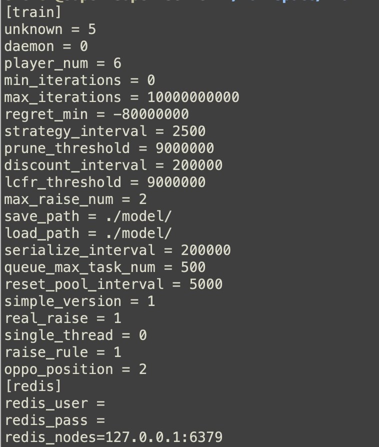
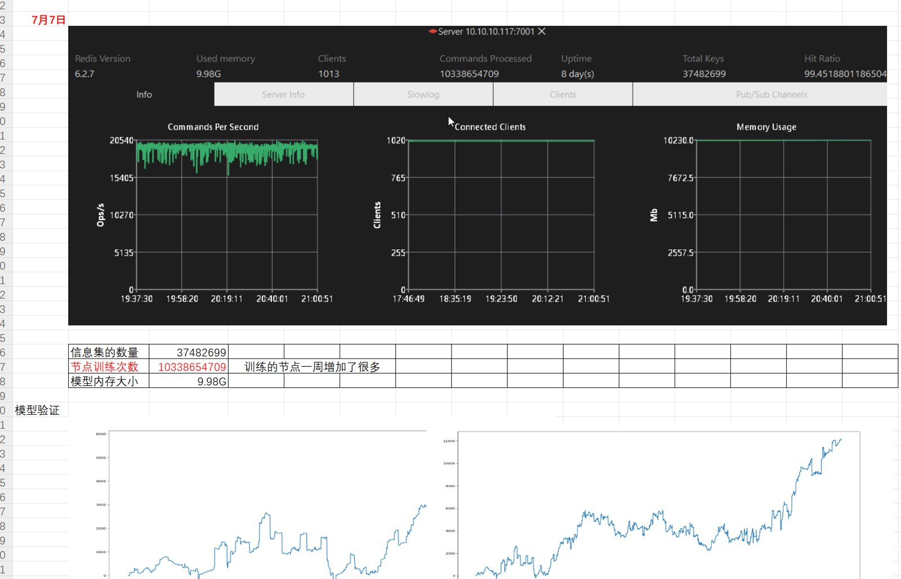

# 德州扑克 AI 源码｜机器人、博弈树、训练与评估系统

> 中文简体 · 中文繁體 · English 多语言产品与源码资料

[简体中文](README.zh-CN.md) · [繁體中文](README.zh-TW.md) · [English](README.en.md) · [产品页面](https://niubideren111.github.io/Texas-Holdem-AI-System/zh-cn/)

面向德州扑克策略研究的 AI 代码资料，包含 C++ 博弈树和任务执行类，以及 Python 训练、评估脚本入口。配套图片展示训练配置、对局界面和评估工具，便于讨论实验与工程结构。

**德州AI · 德州AI源码 · 德州源码 · 德州机器人 · 德州辅助软件 · Poker AI**

## 简介

这是一个面向德州扑克 AI 研究、机器人对局测试和策略实验的代码资料库。公开内容包括 C++ 博弈树、Agent/Trainer 接口、任务队列与执行器，以及 Python 训练、评估和简化 CFR 示例。这里的“德州辅助软件”指开发调试、离线分析、仿真和质量测试工具，不用于在真人牌局中提供未经允许的实时决策。

## 特性

| 特性 | 公开资料 |
|---|---|
| 博弈树建模 | `GameTree.cpp/.hpp` 展示节点、行动历史和树结构 |
| AI Agent 接口 | `Agent.hpp` 提供智能体抽象资料 |
| 训练器接口 | `Trainer.hpp` 展示训练任务组织方式 |
| 并发任务结构 | `Task`、`TaskQueue`、`TaskExecutor` 组成任务执行框架 |
| 训练入口 | `scriptstrain.py` 提供 CFR、PPO、DQN 参数入口，但引用模块需另行核对 |
| 评估入口 | `scriptsevaluate.py` 提供模型、对手类型和局数参数 |
| 简化 CFR 示例 | `examples/scriptsminimal_train.py` 包含可读的最小训练逻辑 |
| 模型评估示例 | 最小评估脚本展示随机对手、局数及收益统计思路 |
| 工程配置 | CMake、Python 包配置、requirements、Docker 示例和测试文件 |

## 架构

```text
牌局状态 / 行动历史
        |
        v
GameTree + Agent/Trainer
        |
        v
TaskQueue -> TaskExecutor
        |
        v
训练脚本 -> 模型文件 -> 评估脚本
        |
        v
随机/CFR等基线、局数、收益与日志
```

| 层级 | 技术组成 |
|---|---|
| 核心结构 | C++ 博弈树、Agent、Trainer 和任务执行类 |
| 实验层 | Python 训练、评估及最小 CFR 演示脚本 |
| 配置层 | `pyproject.toml`、`setup.py`、`requirements.txt` |
| 构建层 | `CMakeLists.txt`、`Makefile.mk`、Docker 示例 |
| 验证层 | 示例脚本、测试样例和评估结果输出入口 |

## 优势

- **C++ 与 Python 分层**：核心结构和实验入口分开，便于研究工程组织。
- **训练与评估分离**：模型生成和对手评估使用不同入口，便于复现实验流程。
- **包含最小示例**：简化 CFR 文件可以作为理解策略累计和行动选择的入口。
- **指标意识明确**：评估入口包含模型、对手和局数参数，适合继续补充规范化基准。
- **适合机器人测试**：可用于离线对局模拟、房间填充机器人研究和服务端 QA。

## 性能与评估

仓库没有足够的完整模型、固定硬件环境、原始评估日志和全部训练模块来证明统一胜率或吞吐量，因此不使用“97% 胜率”“最强 AI”等结论。建议按以下项目记录性能：

| 指标 | 记录方式 |
|---|---|
| 训练耗时 | 算法、迭代数、玩家数、CPU/GPU、总耗时 |
| 推理延迟 | 单次决策平均值、P95、P99 和超时率 |
| 对局吞吐 | 固定硬件每秒或每分钟完成的手数 |
| 策略效果 | 对手类型、随机种子、样本量、胜率与平均收益 |
| 稳定性 | 重复实验的均值、方差和置信区间 |
| 资源使用 | 峰值内存、CPU/GPU 利用率和模型大小 |

性能结论必须绑定具体代码版本、配置、模型、硬件和原始日志。最小 CFR 示例适合教学和流程验证，不代表完整无限注德州扑克求解器的性能。

## 项目重点

### 博弈树结构

GameTree.cpp 与 GameTree.hpp 展示节点、行动历史和树构建相关代码。

### 任务执行组织

Task、TaskQueue 和 TaskExecutor 文件可用于阅读计算任务调度结构。

### 训练与评估入口

scriptstrain.py、scriptsevaluate.py 提供命令行入口资料；实验结论应配合完整模型与评估数据。

## 资料阅读与核对方式

1. **先确认产品形态**：依次查看截图和图注，确认产品类型与可见功能流程。
2. **再核对文件证据**：直接打开下方列出的源码或文档，不只依赖功能描述。
3. **检查可构建范围**：确认准备运行的部分是否具备依赖、资源、配置和启动脚本。
4. **确认授权**：阅读仓库许可；商业素材及完整工程交付应另行取得书面授权。

## 产品截图






## 公开源码与资料

| 文件 | 说明 |
|---|---|
| [GameTree.cpp](GameTree.cpp) | 博弈树实现 |
| [GameTree.hpp](GameTree.hpp) | 博弈树与节点定义 |
| [TaskExecutor.cpp](TaskExecutor.cpp) | 任务执行器 |
| [scriptstrain.py](scriptstrain.py) | Python 训练脚本入口 |
| [scriptsevaluate.py](scriptsevaluate.py) | Python 评估脚本入口 |

## 开始阅读

```bash
git clone https://github.com/niubideren111/Texas-Holdem-AI-System.git
cd Texas-Holdem-AI-System
```

## 常见问题

### 公开文件能复现原介绍的胜率吗？

当前缺少部分训练模块与完整评估材料，本页不重复使用 97% 或最强 AI 等未经复现的结论。

### 从哪里开始阅读 AI 结构？

建议先阅读 GameTree.hpp 和 GameTree.cpp，再看任务执行类与 Python 训练参数入口。

## 后续资料完善方向

补充实验规则、对手基线、随机种子、样本量、模型版本与收益指标；将可复现实验代码按真实路径公开。 后续更新还应加入版本化依赖清单、经过验证的构建或导入步骤、简明架构/产品流程图，以及能对应真实文件变化的版本记录。大型授权资源可放入 GitHub Releases 并提供校验值，不能提交密钥、生产地址或用户数据。

## 相关项目

- [Texas-Holdem-Game-Source-Code](https://github.com/niubideren111/Texas-Holdem-Game-Source-Code)
- [Texas-Hold-em-Tournament-Source-Code](https://github.com/niubideren111/Texas-Hold-em-Tournament-Source-Code)

## 资料范围与许可

公开脚本引用的部分 src 训练模块未随仓库提供。本页展示代码与实验资料，不声称当前公开文件可一键复现胜率结果。 公开内容以实际文件、依赖和许可为准，不承诺搜索排名、直接上线或固定性能结果。

- Telegram: [@fox_lovemyself](https://t.me/fox_lovemyself)
- GitHub: [Texas-Holdem-AI-System](https://github.com/niubideren111/Texas-Holdem-AI-System)
